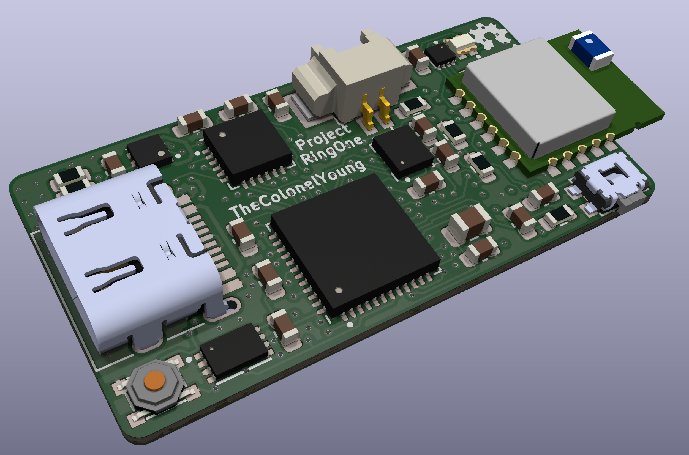
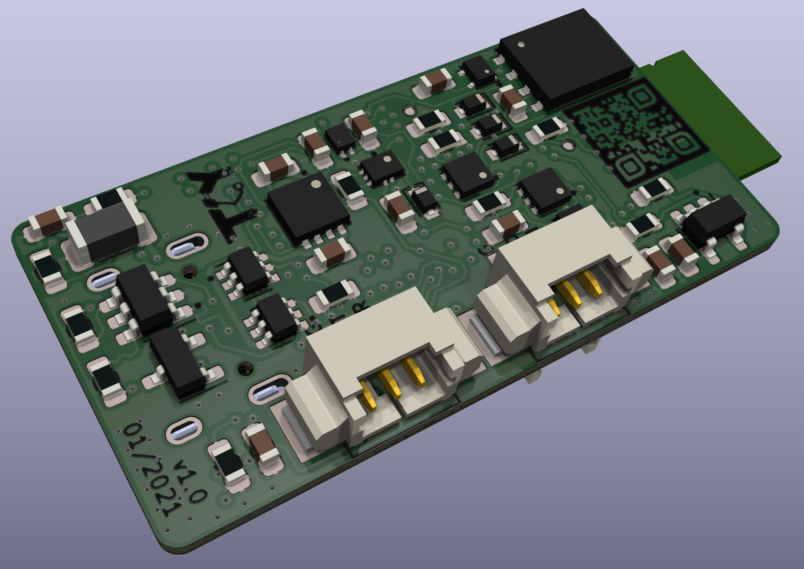

# RingOne  
3D air mouse based on STM32  

Can be used for controlling CADs and every other manipulation in 3D space. Is based around STM32L452, IMU LSM6DSL (gyroscope and accelerometer) and Bluetooth low power module RN4871. Also contains battery management system for charging internal battery and also powering itself from this li-po battery (around 40 mah). Battery can be recharged via USB type C which can be also used for streaming data from accelerometer.  

Advanced USB capabilities are managed by STUSB1600 IC which communicate with host over CC lines. Button near bluettoth module serves as power up and also can be used to wake up device when is in power saving mode. For waking of device can be also used capability of accelerometer to detect taps. RGB LED diode is used to inform user about device status.  

During development, data can be saved to NOR Flash memory on board which is accessible via MCu CLI interface. Also connectors for SWD interface and debug UART are contained.  

## PCB  
 Front | Back |  
-------------------------|-------------------------|  
 |   

Note: black silk screen on back side of PCB should be also white, back color of silkscreen is probably result of some bug in Kicad rendering engine  
